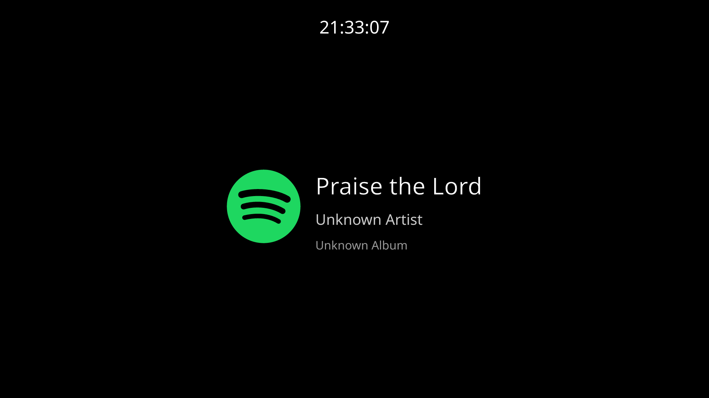
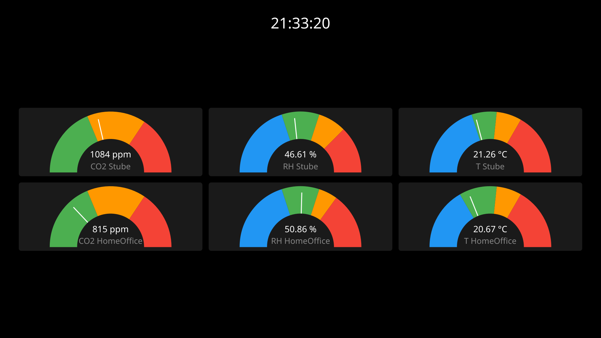

# Raspberry Dashboard

A dashboard for my Raspberry Pi 3B+ connected to a screen.

Widgets:
- Clock (screensaver-style, repositions every 5s)
- Snapcast now-playing (auto-switches when a stream is playing)
- Home Assistant sensors (displays sensor readings with plain cards and gauges)
- Daily Verse (Bible verse of the day from BibleGateway, fetched once per day)
- Quotes (random user-configured quotes, picked fresh each time the widget is shown)

TAB cycles through enabled widgets, q quits. Widgets that require configuration (Home Assistant, Daily Verse, Quotes) are excluded from the cycle when not configured. An optional auto-cycle timer advances to the next widget every N seconds.

## Build

```bash
cargo build          # Local dev build
cargo run            # Run locally
cargo fmt            # Format
cargo clippy         # Lint
```

Cross-compile for Pi:
```bash
cross build --target aarch64-unknown-linux-gnu --no-default-features --features backend-linuxkms-noseat --release
```

## Configuration

- `SNAPCAST_HOST` — Snapcast server address (default: `127.0.0.1:1705`)
- `DASHBOARD_CONFIG` — Path to config file (default: `config.toml`)

### Config file

Optional TOML config file. See [config.toml.example](config.toml.example) for all options.

Key sections:
- `widget_cycle_secs` — auto-cycle interval in seconds (optional; TAB resets the timer)
- `[homeassistant]` — Home Assistant URL, token, poll interval, and sensor list (supports plain cards and gauges)
- `[daily_verse]` — enables the Daily Verse widget; optionally set `version` for a BibleGateway translation (default: `NGU-DE`)
- `[[quotes.items]]` — list of quotes for the Quotes widget; each entry has a `text` and an optional `source`

## Deployment

Copy the binary to `/home/alarm/raspberry-dashboard` and install the systemd unit:
```bash
sudo cp raspberry-dashboard.service /etc/systemd/system/
sudo systemctl enable --now raspberry-dashboard
```

Set `SNAPCAST_HOST` in the `Environment=` line of the service file.

## Screenshots





